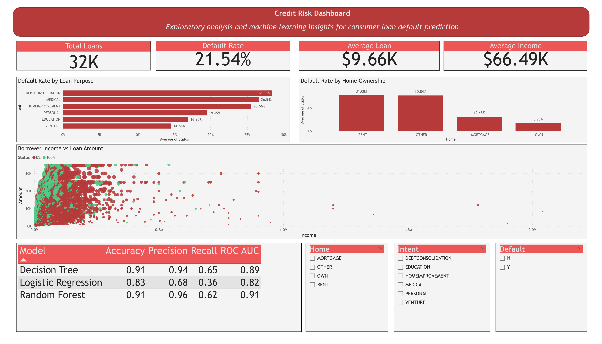
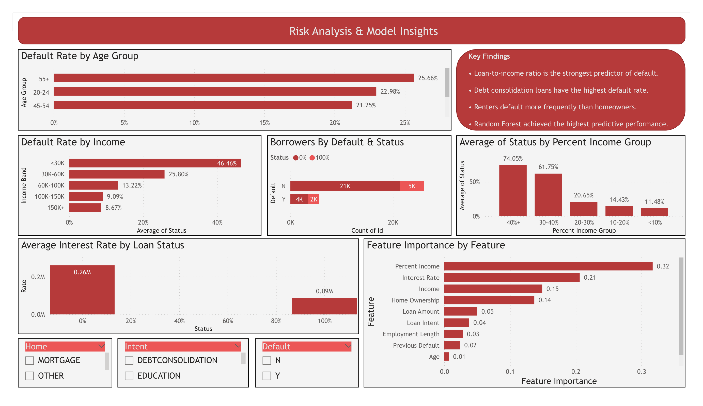

# Credit Risk Analysis & Loan Default Prediction

## Project Overview

This project analyzes consumer loan data to identify the factors that contribute to loan default and builds machine learning models capable of predicting whether a borrower is likely to default.

The project follows a complete end-to-end data analytics workflow including:

* Data cleaning and preprocessing
* Exploratory Data Analysis (EDA)
* Feature engineering
* Machine Learning model development
* SQL business analysis
* Interactive Power BI dashboard
* Business recommendations

The objective is to help financial institutions better understand borrower risk and support more informed lending decisions.

---

# Business Problem

Loan defaults represent a significant financial risk for banks and lending institutions.

The objective of this project is to answer questions such as:

* Which borrowers are most likely to default?
* Which borrower characteristics have the greatest impact on risk?
* Which loan purposes carry the highest default rates?
* Can machine learning accurately predict future defaults?

---

# Dataset

The dataset contains approximately **31,700 consumer loan records** with information including:

* Borrower demographics
* Income
* Employment length
* Home ownership
* Loan purpose
* Loan amount
* Interest rate
* Previous default history
* Credit history length
* Loan status (Default / No Default)

---

# Tools & Technologies

* Python
* Pandas
* NumPy
* Matplotlib
* SQLite
* Scikit-learn
* Joblib
* Power BI
* Git
* GitHub

---

# Project Workflow

1. Data Cleaning
2. Exploratory Data Analysis
3. Feature Engineering
4. Machine Learning
5. Model Evaluation
6. SQL Business Analysis
7. Power BI Dashboard
8. Business Insights & Recommendations

---

# Data Cleaning

The following preprocessing steps were performed:

* Removed unnecessary identifier column from model features
* Checked missing values
* Verified data types
* Created age groups
* Created income bands
* Encoded categorical variables
* Prepared features for machine learning
* Exported cleaned dataset for SQL and Power BI

---

# Exploratory Data Analysis

The exploratory analysis identified several important patterns.

### Home Ownership

* Renters showed substantially higher default rates than homeowners.
* Mortgage holders had significantly lower risk.

### Loan Purpose

Debt consolidation loans produced the highest default rate among all loan purposes.

### Previous Default History

Borrowers with previous defaults were much more likely to default again.

### Income

Lower-income borrowers showed considerably higher default rates.

### Loan-to-Income Ratio

Borrowers spending a larger percentage of their income on loans had substantially higher default risk.

---

# Machine Learning Models

Three classification models were developed and compared.

| Model               |  Accuracy | Precision |    Recall |    ROC AUC |
| ------------------- | --------: | --------: | --------: | ---------: |
| Logistic Regression |     82.5% |     67.9% |     35.8% |     0.8188 |
| Decision Tree       |     91.5% |     93.9% |     64.7% |     0.8938 |
| Random Forest       | **91.2%** | **95.8%** | **61.6%** | **0.9129** |

The Random Forest model achieved the highest overall predictive performance and was selected as the final model.

---

# Feature Importance

The Random Forest model identified the following variables as the strongest predictors of default:

1. Loan-to-Income Ratio
2. Interest Rate
3. Income
4. Home Ownership
5. Loan Amount

These findings closely matched the patterns discovered during exploratory analysis.

---

# SQL Analysis

SQLite was used to perform business-oriented analysis including:

* Default rate by loan purpose
* Default rate by home ownership
* Previous default analysis
* Model performance storage
* Borrower segmentation

---

# Power BI Dashboard

## Executive Overview



The Executive Overview summarizes:

* Portfolio KPIs
* Default rate
* Loan purpose analysis
* Home ownership analysis
* Machine learning feature importance
* Model comparison

---

## Risk Analysis



The Risk Analysis page focuses on:

* Default rate by age group
* Default rate by income band
* Previous default behavior
* Loan-to-income analysis
* Key business findings

---

# Key Business Insights

* Overall default rate is approximately **21.5%**.
* Debt consolidation loans have the highest default rate.
* Renters default more frequently than homeowners.
* Previous defaults strongly increase future default risk.
* Lower-income borrowers are considerably more likely to default.
* Loan-to-income ratio is the strongest predictor of default.
* Random Forest achieved the best predictive performance.

---

# Business Recommendations

Based on this analysis, lenders should consider:

* Paying closer attention to applicants with high loan-to-income ratios.
* Applying stricter approval policies for debt consolidation loans.
* Using previous default history as an important underwriting feature.
* Providing additional risk assessment for lower-income applicants.
* Integrating machine learning models into the loan approval process to improve risk management.

---

# Repository Structure

```
credit-risk-analysis/
│
├── data/
│   ├── raw/
│   └── processed/
│
├── notebooks/
│
├── dashboard/
│   └── images/
│
├── models/
│
├── outputs/
│
├── sql/
│
└── README.md
```

---

# How to Run

1. Clone the repository.
2. Install the required Python libraries.
3. Run the Jupyter notebook inside the `notebooks` folder.
4. Open the Power BI dashboard to explore the interactive visualizations.

---

# Future Improvements

Potential future enhancements include:

* Hyperparameter tuning
* XGBoost and LightGBM models
* Cross-validation
* SHAP model explainability
* Model deployment with Streamlit or Flask

---

## Author

**Amirhossein Ashrafi**

This project was developed as part of my Data Analytics portfolio, demonstrating end-to-end skills in data cleaning, machine learning, SQL, and business intelligence.